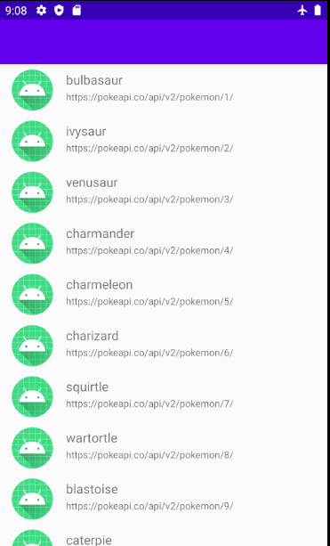
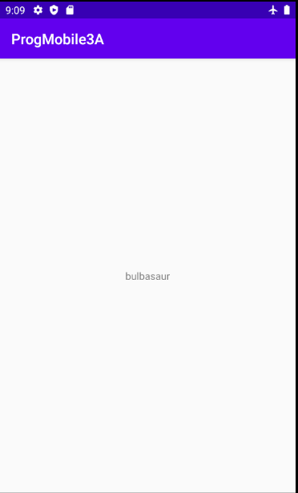

# ProgMobile3A

## Présentation

Projet d'initiation à la programmation mobile de 3A, c'est une application android codé en Java.
Elle permet grâce à l'API PokéAPI d'affiché différent Pokemon.

## Consigne minimale :

- Ecran avec une liste d’éléments.
- Ecran avec le détail d’un élément.
- Appel WebService à une API Rest.
- Stockage de données en cache

## Ajout :

- Architecture :
  - Singleton
  - MVC
- Essaie de Gitflow

## L'application :

### Premier écran

- Affichage d'une liste récupérée depuis une API rest

### Second écran

- Affiche des informations sur le pokemon sélectioné.

